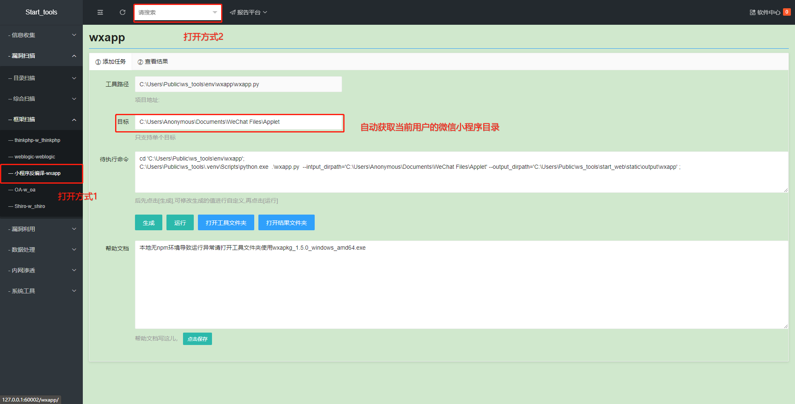
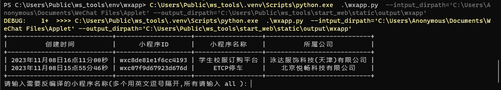
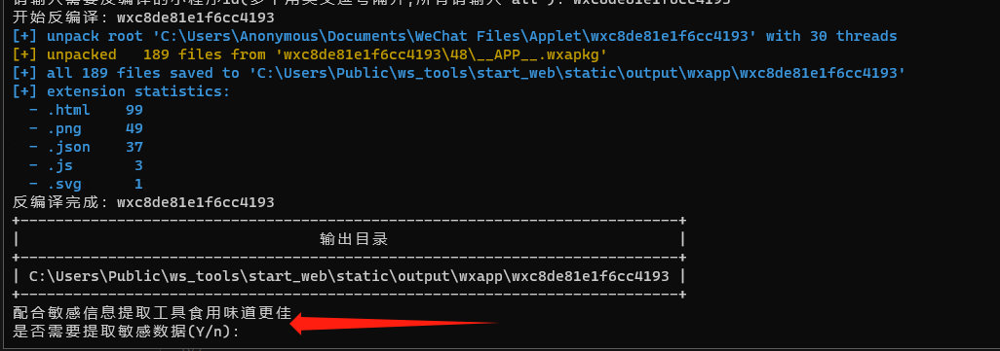
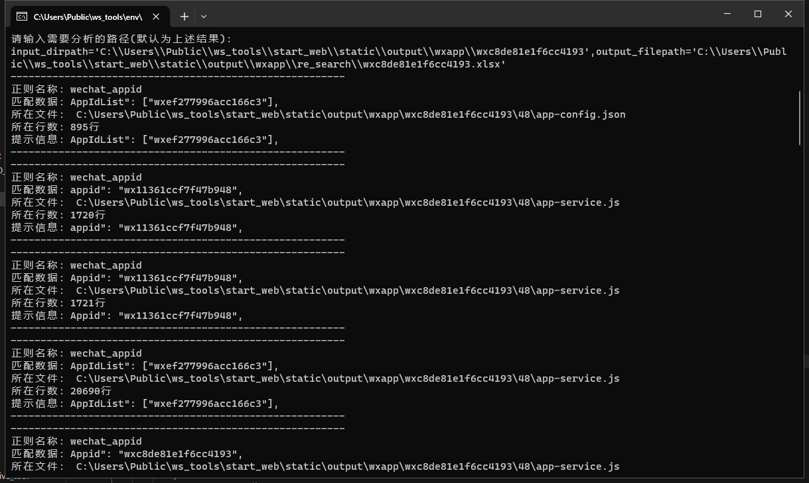
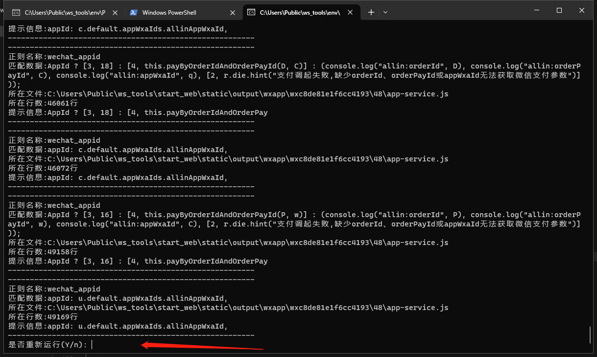

# 小程序反编译
## 项目说明
1. 总项目地址：https://github.com/wwsuixin/ws_tools
2. 单项目地址：https://gh.con.sh/https://github.com/wwsuixin/ws_tools/releases/download/latest/wxapp.zip
3. 该项目可单独下载使用
4. 该项目为二开项目，感谢以下作者
	1. https://github.com/wux1an/wxapkg/tree/v1.5.0
	2. https://github.com/G0mini/PyBy2

## 访问方式

## 注意事项

1.  无
## 功能介绍

-   输入【目标】后点击【生成】再点击【运行】，将自动调用powershell执行命令
- 运行后，将自动获取当前已加载的小程序id并按时间降序排列（小程序名称获取功能后续更新）
- 可输入all反编译所有，也可复制单独的某个id

- 反编译完成后自动调用正则匹配工具进行ak等敏感信息的提取

- 正则匹配信息如下

- 程序执行完后将询问是否再次运行方便反编译其他小程序

