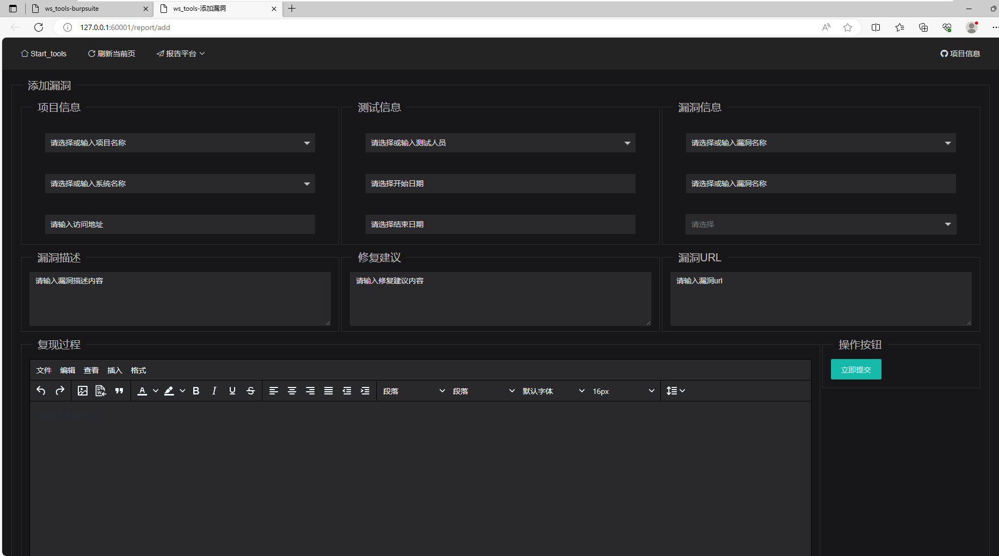
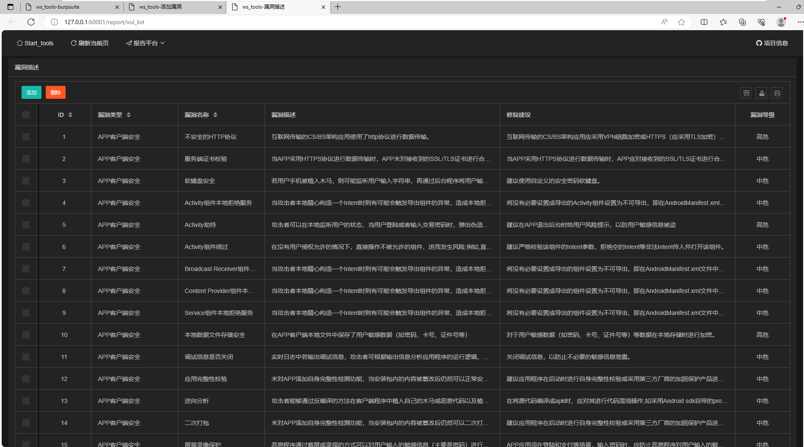
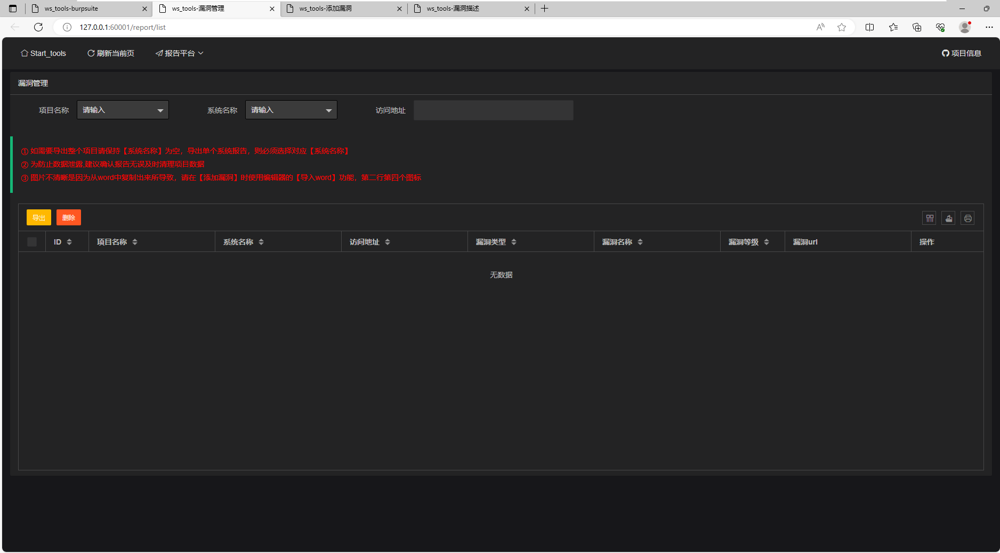

# 报告平台

## 访问方式

## 注意事项

1.  需要安装office-word软件，并设置docx文件类型打开方式为默认程序
2.  需要安装pandoc应用程序并设置环境变量，cmd可直接调用pandoc.exe
3.  报告模板在demo目录下的demo.docx文件，如需修改，使用变量参考自带模板
## 功能介绍
### 添加漏洞

-   【项目信息】可下拉选择曾有的项目，如果没有可直接输入创建新的项目

### 漏洞描述

-   内置200+漏洞描述信息，可根据情况选择及修改默认描述

### 漏洞管理

-   支持导出word版本漏洞报告
-   支持重新编辑漏洞信息

