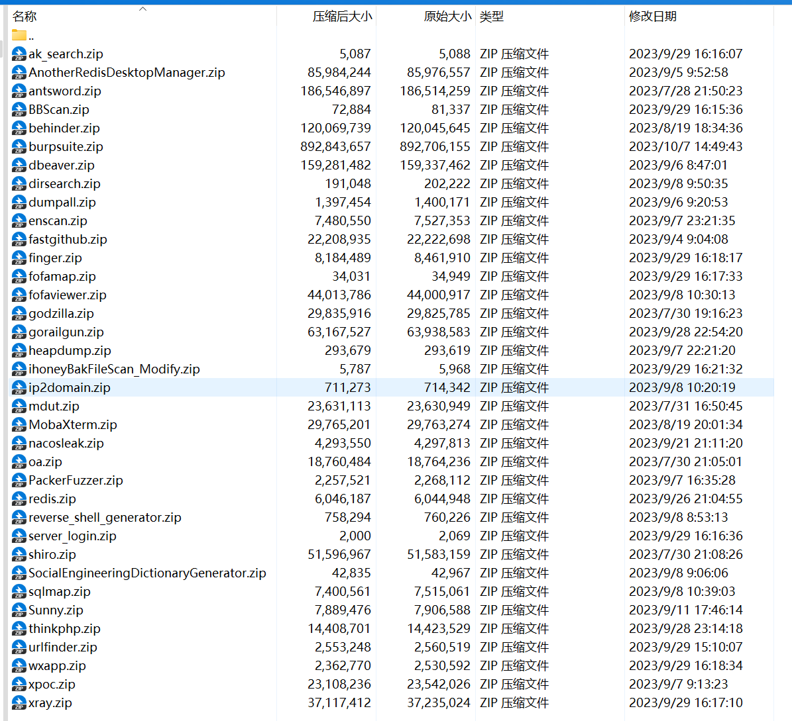

# ws\_tools使用手册
# 项目简介
1.  项目说明
    -   本项目支持免安装运行
    -   本项目通过python-flask作为服务端、layui作为web前端进行开发，意在提高日常渗透中常用工具使用的效率，如sqlmap的post注入不在需要手动创建文件、指定路径等重复工作
    -   本项目内python脚本均使用pdm虚拟环境进行运行
    -   项目基于AMD x64 windows 10环境开发，其他环境可能存在不兼容情况，请自测
2.  项目地址
    -  https://github.com/wwsuixin/ws_tools

# 安装说明

1. 源码打包下载后运行**start.bat**即可
2. bat文件将自动下载python311、java1.8、Java17、git等依赖环境
3. bat文件将自动安装pdm及其所使用到的依赖包
4. 所有环境安装完成后将开启60001服务端口并自动使用默认浏览器打开**http://127.0.0.1:60001**

# 常见问题
- 问题：默认内置版本为python3.11
	- 解答：不支持win10以下版本
- 问题：安装python依赖环境遇到报错：` Microsoft Visual C++ 14.0 or greater is required`
	- 解答：参考文章：https://zhuanlan.zhihu.com/p/471661231
1. 
2. 

# 功能展示

-   工具首页，包含原创工具，如【报告平台、md5碰撞、fscan结果分析及验证、正则提取】等

_LTh5Ggtr7X.png>)

-   已兼容第三方工具列表，如【sqlmap、fofamap、dirseach、finger】等，逐步调试稳定后放出

# 工具列表

## 其他
- [报告平台](image/报告平台.md)
