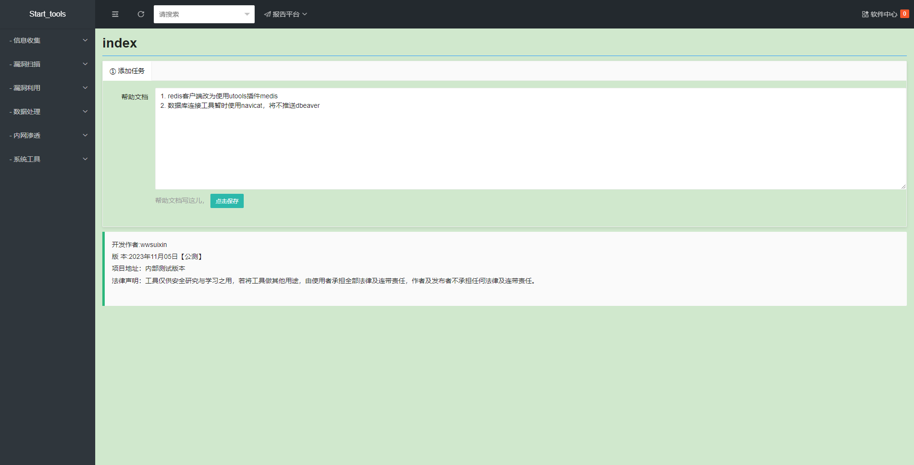
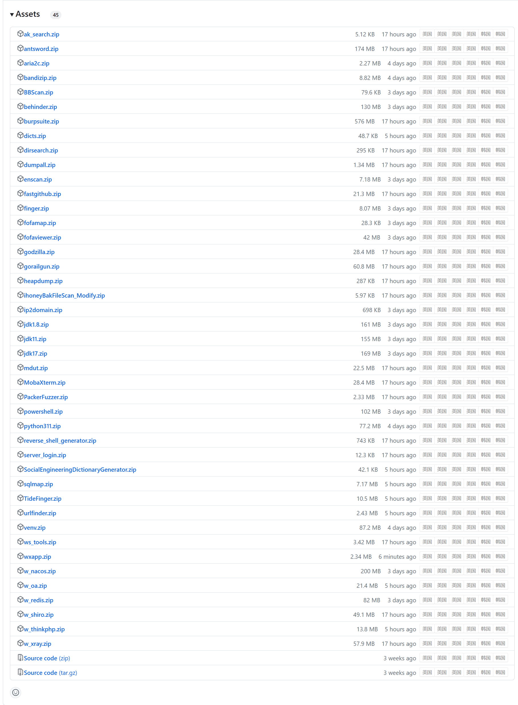

# ws\_tools使用手册
# 项目简介
1.  项目说明
    -   本项目支持免安装运行
    -   本项目通过python-flask作为服务端、layui作为web前端进行开发，意在提高日常渗透中常用工具使用的效率，如sqlmap的post注入不在需要手动创建文件、指定路径等重复工作
    -   本项目内python脚本均使用pdm虚拟环境进行运行
    -   项目基于AMD x64 windows 10环境开发，其他环境可能存在不兼容情况，请自测
2.  项目地址
    -  https://github.com/wwsuixin/ws_tools

# 安装说明

1. 复制以下代码到某文件夹下的bat即可自动安装运行
2. 所有环境安装完成后将开启60001服务端口并自动使用默认浏览器打开**http://127.0.0.1:60001**
3. 后续运行也仅需要双击该bat文件
```bat
@echo off 

setlocal enabledelayedexpansion
title ws_tools

@REM 切换到当前目录
cd /d %~dp0

@REM 设置代理url
set http_proxy=https://gh.con.sh

if not exist run.ps1 (
    echo [-]检测到当前环境还未安装, 开始下载运行脚本
    powershell -ExecutionPolicy Bypass -Command "& {iwr -useb !http_proxy!/https://github.com/wwsuixin/ws_tools/raw/main/run.ps1 -OutFile run.ps1}"
)
if not exist run.ps1 (
    echo [-]网络环境异常,请检查网络......
    pause
    exit
)
powershell -ExecutionPolicy Bypass -File run.ps1 !http_proxy!

```

# 常见问题
- 问题：默认内置版本为python3.11
	- 解答：python311不支持win10以下版本
- 问题：安装python依赖环境遇到报错：` Microsoft Visual C++ 14.0 or greater is required`
	- 解答：参考文章：https://zhuanlan.zhihu.com/p/471661231


# 功能展示

-   工具首页




-   已兼容第三方工具列表，如【sqlmap、fofamap、dirseach、finger】等，可从软件中心自动下载




# 工具列表[编写中]

## 漏洞扫描
### 框架扫描
- [小程序反编译](files/小程序反编译.md)
## 其他
- [报告平台](files/报告平台.md)