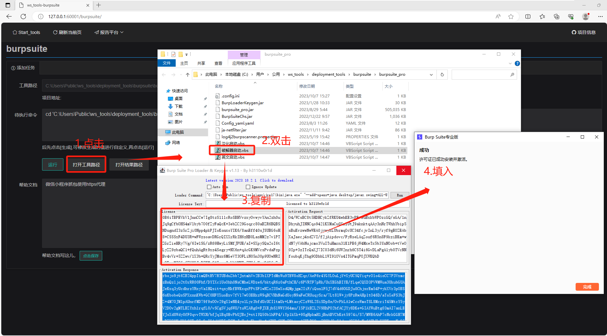

# ws\_tools使用手册


# 功能展示

-   工具首页，包含原创工具，如【报告平台、md5碰撞、fscan结果分析及验证、正则提取】等

_LTh5Ggtr7X.png>)

-   已兼容第三方工具列表，如【sqlmap、fofamap、dirseach、finger】等


# 项目简介

1.  项目说明
    -   本项目支持免安装运行
    -   本项目通过python-flask作为服务端、layui作为web前端进行开发，意在提高日常渗透中常用工具使用的效率，如sqlmap的post注入不在需要创建文件、指定路径、手敲命令进行
    -   本项目内python脚本均使用pdm虚拟环境进行运行，默认已内置依赖
    -   项目基于AMD x64版本windows 10环境开发
2.  项目地址
    -   说明文档：[https://workspace.dingtalk.com/aKQLHKNh2G9YbEkn5JUcQe](https://workspace.dingtalk.com/aKQLHKNh2G9YbEkn5JUcQe "https://workspace.dingtalk.com/aKQLHKNh2G9YbEkn5JUcQe")
    -   下载地址：[https://www.123pan.com/s/D2qTjv-C9PoA.html提取码:SZYr](https://www.123pan.com/s/D2qTjv-C9PoA.html提取码:SZYr "https://www.123pan.com/s/D2qTjv-C9PoA.html提取码:SZYr")

# 安装说明

1.  多个工具内部使用绝对路径进行相互调用，强烈建议将【ws\_tools.zip】解压到`C:\Users\Public`路径下

    
2.  默认已携带运行环境依赖，若存在无.venv文件夹，则需要使用pdm初始化安装项目依赖，在`C:\Users\Public\ws_tools`目录下运行如下命令

```bash
.\env\python3\python3.exe  .\env\get-pip.py
.\env\python3\python3.exe -m pip config set global.index-url https://mirrors.aliyun.com/pypi/simple/
.\env\python3\python3.exe -m pip install pdm
.\env\python3\Scripts\pdm.exe  config pypi.url https://mirrors.aliyun.com/pypi/simple/
.\env\python3\Scripts\pdm.exe install

```

1.  部署后文件夹情况，双击【999-start\_web.bat】运行


1.  使用浏览器访问[http://127.0.0.1:60001](http://127.0.0.1:60001 "http://127.0.0.1:60001")


1.  界面展示

_LTh5Ggtr7X.png>)

# 工具说明

## 其他

#### 报告平台

##### 访问方式


##### 注意事项

1.  需要安装office-word软件，并设置docx文件类型打开方式为默认程序
2.  需要安装pandoc应用程序并设置环境变量，cmd可直接调用pandoc.exe
3.  报告模板在demo目录下的demo.docx文件，如需修改，使用变量参考自带模板

##### 添加漏洞

-   【项目信息】可下拉选择曾有的项目，如果没有可直接输入创建新的项目


##### 漏洞描述

-   内置200+漏洞描述信息，可根据情况选择及修改默认描述


##### 漏洞管理

-   支持导出word版本漏洞报告
-   支持重新编辑漏洞信息


## 信息收集


### 单位名称

#### 企业信息收集-enscan


#### 教育网IP段查询


### 域名、IP

#### fofamap


#### Fofa客户端-fofaviewer

#### Ip查询\[域名、权重、备案]-ip2domain

#### Ip查询\[归属地]-cip.cc

### 指纹识别

#### finger


### 抓包工具

#### burpsuite

##### 初始化说明


##### 工具激活

-   首次使用需要输入许可证密钥进行激活




#### 扩展加载

##### 配置文件

-   选择路径`C:\Users\Public\ws_tools\deployment_tools\burpsuite\burpsuite.config.json`


##### 注意

-   配置文件中的扩展默认加载路径为\``C:\Users\Public\ws_tools\deployment_tools\burpsuite\burpsuite_extension`\`，因此若ws\_tools运行路径非`C:\Users\Public`下则需要重新加载

#### Sunny-小程序

## 漏洞扫描

### 目录扫描

#### dirsearch


#### PackerFuzzer

#### url收集-urlfinder

#### 网站敏感信息扫描-bbscan

#### 网站备份文件扫描-ihoneyBakFileScan\_Modify

### 综合扫描

#### xray


#### xpoc

#### nuclei

#### tidefinger

#### gorailgun

### 框架扫描

#### thinkphp

#### weblogic

#### 小程序反编译-wxapp


#### OA

#### shiro

## 漏洞利用

### 数据库利用

#### sqlmap


#### dbeaver

#### redis

#### MDUT

### webshell连接

#### antsword

#### behinder

#### godzilla

### 框架利用

#### .git/.svn/.DS\_Store利用

#### Nacos


#### heapdump


#### 反弹shell

## 数据处理

### 综合

#### 正则-同类数据提取

##### 项目介绍

-   由于渗透项目经常遇到js中有api接口，为了方便提取该类数据则开发此工具

##### 使用说明

-   由于浏览器复制大文件时会卡顿，因此该工具支持两种模式，直接【输入文本】模式以及【上传文件】模式
-   正则表达式可通过鼠标选择【文本内容】框内需要提取的文字自动生成，也可自行编写正则表达式


#### URL处理


#### 掩码转IP

#### 正则-敏感数据提取

-   用于提取特定文件夹中内所有文件包含的ak/sk、username、password等敏感信息并输出为execl

### 字典

#### md5碰撞-多个

##### 工具页面


##### 使用说明

_8jbC0iXmDC.png>)


#### 字典生成-个人

#### 默认用户密码查询


## 内网渗透

### 内网资产

#### 进程识别

### 内网横向

#### fscan结果分析

##### 使用说明

- 【目标】处输入fscan结果，可分类输出各类信息，验证过程请参考

  


-   当前已支持ssh联动【服务批量验证】进行截图
-   后续计划支持sql、web等结果联动验证

#### 服务登录验证

-   主要用于与fscan结果分析联动使用


## 系统工具

### 代理

#### socks代理

#### fastgithub

### 综合

#### 系统命令执行

#### 痕迹清理

-   由于需要经常清理临时文件
-   每次使用将自动保存需要清理的路径


#### MobaXterm

#### test
